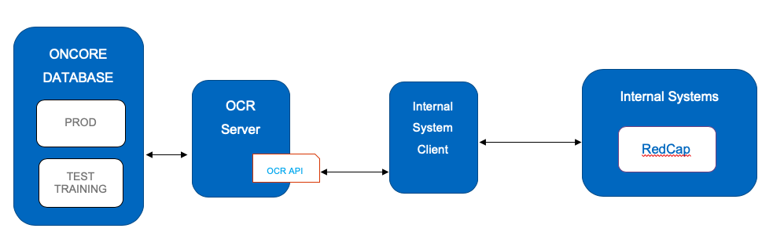

# UF's OCR API

This document provides an overview of the REST-based OCR API and its technical infrastructure, as developed and provided by Office of Clinical Research at University of Florida. Readers of this document are assumed knowledgeable in the areas of web-based technologies.
The API supports a get protocol operation that returns a list of protocol#s and their titles available in OnCore.

## Architecture
The REST-based API employs a design based on FLASK framework and utilizes Hypertext Transfer Protocol Secure (HTTPS) as the transport protocol. JSON is used as the data exchange format to ensure the communications. The OCR API is a stand-alone module and is deployed within your institutional server which has access to the OnCore database's.
 


## Security

Access to any operation within the OCR API requires authentication. A token, and an OnCore username is used to authenticate a request. A random sequence of character(api_key) of a certain length is stored with the associated user(api_user) in the environment file. The api key is unique and has a one to one relation with the user. The api key has no expiration date and is verified with a string comparision. The api user is validated against OnCore's User table to verify the account access.

## Using the API
The OCR API makes available the endpoint for the registered URL.

```
• URI scheme: /api/{operation_name}
• Consumes: application/json
• Produces: application/json
• Operation name: protocols
• Headers: x-api-key(the secret key provided to the user)
           x-api-user(User name)
```

### Description:

Returns a list of protocol no, and title in a JSON format. Receives the header data in JSON format. Authorizes the User via token based authentication. On success, prepares a JSON object with all the protocol # and titles available in OnCore. This object can be cached. The cache time is configurable and is discussed in detail under deployment session.


### Response

| Code | Description        |Schema                          |
| ---- | ------------------ | ------------------------------ |
| 200  | Protocol #'s, and titles | `<Protocols>`Array  |

#### Protocols list

| Index| Description        |Schema                          |
| ---- | ------------------ | ------------------------------ |
|   0  | OnCore Protocol No.| String |
|   1  | OnCore Title.| String |

## Deployment

Docker public image is available for the OCR-API. This image serves as an environment to execute OCR-API in the server you wish.
 
### Prerequisites

- Docker Engine >= 1.10.0
- Docker Compose is recommended with a version 1.6.0 or later.
- Access to the OnCore database servers

### How to use this image
`Note: The URL's point to the developer's image the global image will be updated soon`

Run the below command to pull the image and run OCR API on your server. THE OCR API runs on http://localhost:5000 with the current directory as our workspace. The option of --env-file is added to provide the configured environmental variable's. 

    # script to run the image
    docker run -p 5000:5000 --env-file {your_env_file_location} -v {your_log_file_dir}:$log_file hkoranne/ocr_api:latest

In order to run API on https connection additional proxy settings might be required. Please contact your server administrator to verify if you can create a proxy on port 5000.

### Variables
- your_env_file_location: the location of the environment file. This file includes all the required environmental variables
- your_log_file_dir: the location to the folder where you desire to volume the log files

### Environmental variables

The following variables and required:
- Database connection variables:
    - username: This variable is used to provide the OnCore database user name
    - password: This variable is used to provide the OnCore database password
    - hostname: This variable is used to provide the OnCore database hostname
    - sid: This variable is used to provide the OnCore serviceid
- Other variables:
    - log_file: This variable is used to provide the log file location for the application.
    - timeout: This variable is used to provide the cache duration
    - api_user_1: This variable is used to provide the whitelisted username
    - api_key_1: This varaible is used to provide the key for the api_user_1

### Image variants

`hkoranne/ocr_api:latest`

This image is based on the latest stable version

`hkoranne/ocr_api:<version>`

This image is based on the given stable version

`hkoranne/ocr_api:develop`

This image is based on the current state and is used to test out the developments before publishing


## Implementation and Maintenance
The client application is developed, tested, and maintained by the customers. During OnCore upgrades time and resources need to be allocated to ensure the client applications and the OCR API workflows continue to work as expected.


